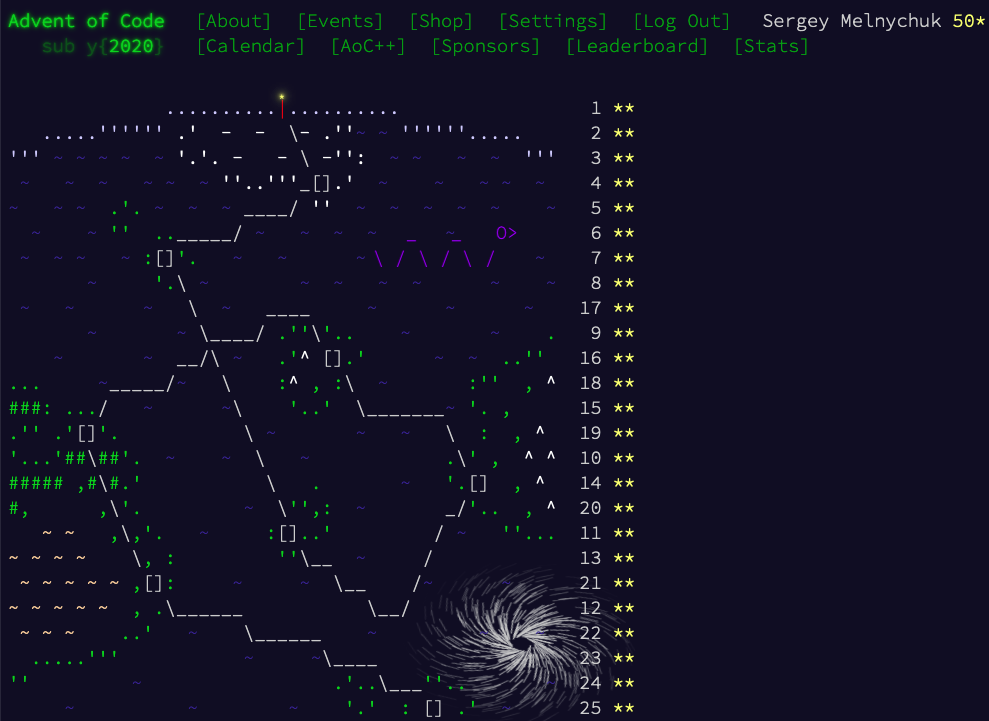

advent-of-code-2020
===================

### Day XX

`cargo run --example dayXX < inputs/dayXX.txt`

### Notes

- Day 21
  - part 2: Chosen approach might work from another side of the problem!
- Day 23
  - part 1: Numbers 0..N among input data can (and sometimes should) be used as array indices.
  - part 2: Avoid copying too much data over, and keep in mind that linked list might be useful.

